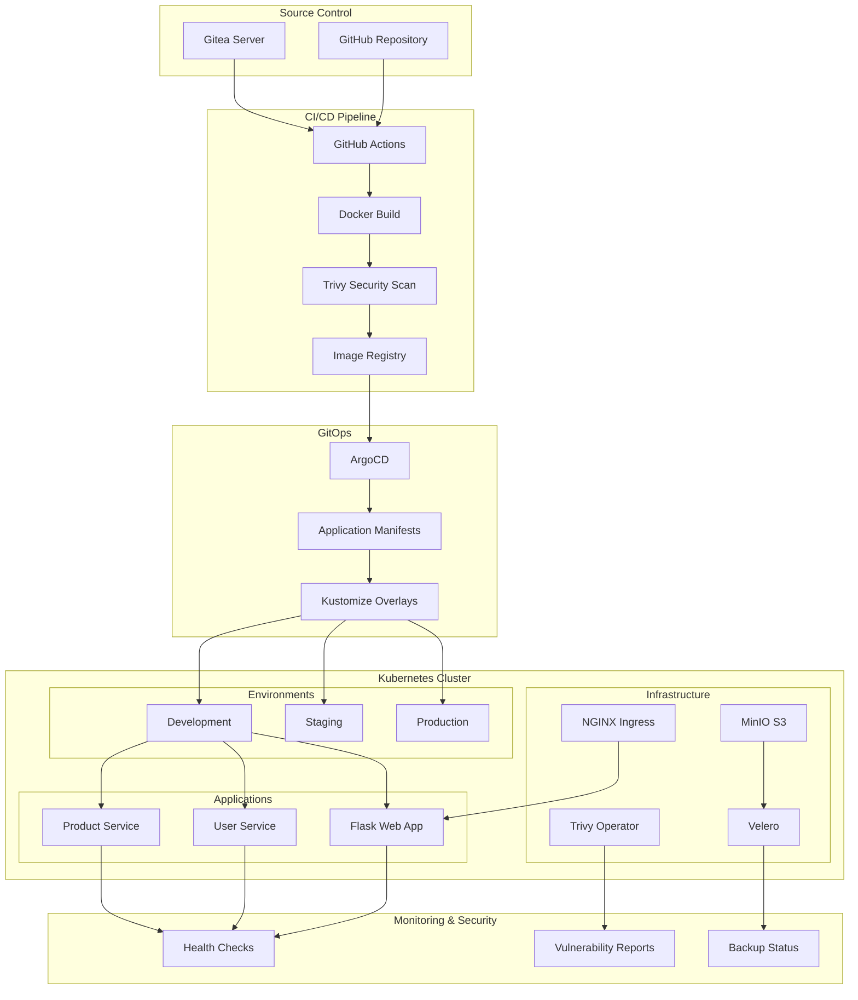
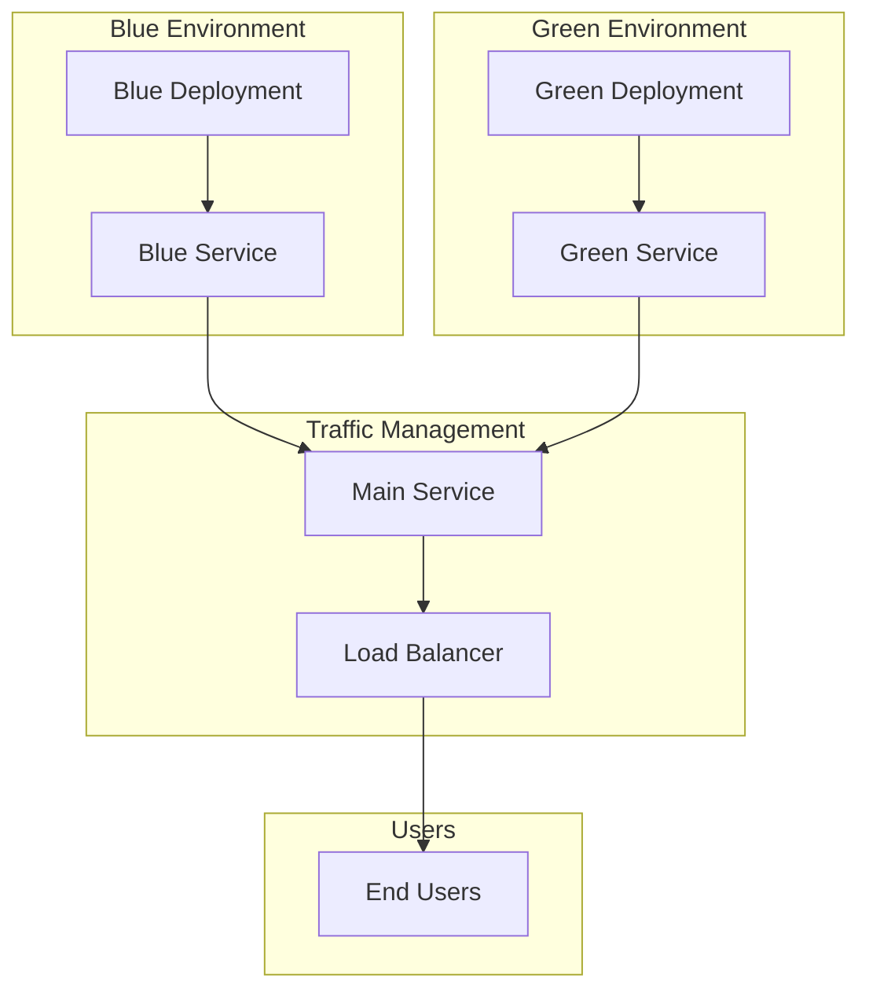

# 🚀 Unified Production-Ready DevOps Pipeline

A comprehensive DevOps ecosystem integrating Flask web application with microservices architecture, featuring GitOps with ArgoCD, automated CI/CD, container security scanning, multi-environment deployment, blue-green strategy, and backup & disaster recovery.

## 📋 Table of Contents

- [Overview](#overview)
- [Architecture](#architecture)
- [Prerequisites](#prerequisites)
- [Quick Start](#quick-start)
- [Detailed Setup](#detailed-setup)
- [Usage](#usage)
- [Access URLs](#access-urls)
- [Features](#features)
- [Documentation](#documentation)
- [Troubleshooting](#troubleshooting)
- [Contributing](#contributing)

## 🏗️ Overview

This project implements a complete production-ready DevOps pipeline with the following components:

- **Flask Web Application**: Modern Python web app with Bootstrap UI
- **Microservices Architecture**: User Service and Product Service with REST APIs
- **GitOps Workflow**: ArgoCD for automated deployments
- **Git Server**: Self-hosted Gitea for PoC
- **Container Orchestration**: Kubernetes (kind/k3s)
- **Configuration Management**: Helm and Kustomize
- **Security Scanning**: Trivy CLI (CI) and Trivy Operator (in-cluster)
- **Backup & DR**: Velero with MinIO as S3 backend
- **Deployment Strategy**: Blue-Green Deployments
- **Documentation**: MkDocs-based documentation system

## 🏛️ Architecture

### System Architecture Diagram



### Deployment Flow Diagram


### Blue-Green Deployment Diagram



## 📋 Prerequisites

### System Requirements
- **OS**: Ubuntu 20.04+ or Debian 11+
- **RAM**: Minimum 4GB (8GB recommended)
- **Disk**: Minimum 20GB free space
- **CPU**: 2+ cores recommended
- **Network**: Internet connectivity

### Required Permissions
- Sudo privileges
- Docker group membership
- Kubernetes cluster access

## 🚀 Quick Start

### One-Command Setup

```bash
# Clone the repository
git clone https://github.com/your-org/devops-pipeline.git
cd devops-pipeline

# Run complete setup (Ubuntu/Debian)
chmod +x setup_prereqs.sh bootstrap_cluster.sh deploy_pipeline.sh check_env.sh
./setup_prereqs.sh && ./bootstrap_cluster.sh && ./deploy_pipeline.sh && ./check_env.sh
```

### Verify Installation

```bash
# Check all components
./check_env.sh

# Expected output: ✅ All health checks passed! 🎉
```

## 📖 Detailed Setup

### Step 1: Install Prerequisites

```bash
# Make script executable
chmod +x setup_prereqs.sh

# Run prerequisites installation
./setup_prereqs.sh
```

**What gets installed:**
- Docker and Docker Compose
- kubectl
- kind (Kubernetes in Docker)
- Helm
- ArgoCD CLI
- Trivy
- Velero
- Kustomize
- MkDocs

### Step 2: Bootstrap Kubernetes Cluster

```bash
# Make script executable
chmod +x bootstrap_cluster.sh

# Bootstrap the cluster
./bootstrap_cluster.sh
```

**What gets created:**
- Kind Kubernetes cluster with 3 nodes
- NGINX Ingress Controller
- Gitea Git server
- ArgoCD GitOps controller
- MinIO S3 storage
- Trivy Operator for security scanning
- Velero for backup and recovery

### Step 3: Deploy Applications

```bash
# Make script executable
chmod +x deploy_pipeline.sh

# Deploy the pipeline
./deploy_pipeline.sh
```

**What gets deployed:**
- Flask web application
- User service microservice
- Product service microservice
- Kubernetes manifests for all environments
- ArgoCD applications
- Ingress resources

### Step 4: Verify Deployment

```bash
# Make script executable
chmod +x check_env.sh

# Run health checks
./check_env.sh
```

**Health checks verify:**
- Cluster status
- All namespaces
- ArgoCD applications
- Infrastructure components
- Application deployments
- Service endpoints

## 🌐 Access URLs

After successful installation, access your applications:

| Service | URL | Credentials |
|---------|-----|-------------|
| **Flask App** | http://flask-app.local | - |
| **Gitea** | http://gitea.local | admin/admin123 |
| **MinIO** | http://minio.local | minioadmin/minioadmin123 |
| **ArgoCD** | http://argocd.local | admin/[see below] |

### Get ArgoCD Password

```bash
# Get ArgoCD admin password
kubectl -n argocd get secret argocd-initial-admin-secret -o jsonpath="{.data.password}" | base64 -d
```

## 🎯 Usage

### Test the Pipeline

#### 1. Blue-Green Deployment Demo

```bash
# Run blue-green deployment demo
./switch_blue_green.sh demo
```

#### 2. Backup and Restore Demo

```bash
# Run backup and restore demo
./backup_restore_demo.sh demo
```

#### 3. Security Scan Demo

```bash
# Scan Flask app
trivy image --severity HIGH,CRITICAL flask-app:latest

# Scan User service
trivy image --severity HIGH,CRITICAL user-service:latest

# Scan Product service
trivy image --severity HIGH,CRITICAL product-service:latest
```

### Monitor Applications

#### Check Application Status

```bash
# Check all pods
kubectl get pods -A

# Check ArgoCD applications
kubectl get applications -n argocd

# Check services
kubectl get services -A
```

#### View Application Logs

```bash
# Flask app logs
kubectl logs -n dev deployment/flask-app

# User service logs
kubectl logs -n dev deployment/user-service

# Product service logs
kubectl logs -n dev deployment/product-service
```

### Access Applications

#### Flask Web Application

```bash
# Access via browser
open http://flask-app.local

# Or via curl
curl http://flask-app.local/api/health
```

#### Microservices APIs

```bash
# User service API
curl http://user-service:5001/api/users

# Product service API
curl http://product-service:5002/api/products
```

## ✨ Features

### 🔄 GitOps Workflow
- ArgoCD-managed deployments from Git
- Automated sync for development
- Manual approval for staging and production
- Kustomize overlays for environment-specific configurations

### 🔒 Security Integration
- Container vulnerability scanning with Trivy
- Security reports in CI/CD pipeline
- In-cluster security monitoring
- RBAC configurations for Kubernetes

### 🔄 Blue-Green Deployments
- Zero-downtime deployments
- Automated traffic switching
- Rollback capabilities
- Health check validation

### 💾 Backup & Recovery
- Automated backups with Velero
- S3-compatible storage with MinIO
- Disaster recovery testing
- Cross-environment restore capabilities

### 🌍 Multi-Environment Support
- Development, staging, and production environments
- Environment-specific resource scaling
- Separate secrets and configurations
- Automated promotion pipeline

### 📊 Monitoring & Observability
- Comprehensive health checks
- Application metrics endpoints
- Infrastructure monitoring
- Log aggregation and analysis

## 📚 Documentation

The project includes comprehensive documentation:

### 📖 Main Documentation
- **[Architecture Overview](docs/architecture.md)**: Detailed system architecture
- **[Quick Start Guide](docs/quick-start.md)**: Get started in minutes
- **[Security Guide](docs/security.md)**: Security best practices
- **[Monitoring Guide](docs/monitoring.md)**: Monitoring and observability
- **[Troubleshooting Guide](docs/troubleshooting.md)**: Common issues and solutions
- **[API Reference](docs/api-reference.md)**: Complete API documentation

### 📋 Runbooks
- **[Installation Runbook](docs/runbooks/installation.md)**: Step-by-step installation
- **[CI/CD Pipeline Runbook](docs/runbooks/cicd-pipeline.md)**: Pipeline procedures
- **[GitOps Sync Runbook](docs/runbooks/gitops-sync.md)**: GitOps synchronization
- **[Blue-Green Switch Runbook](docs/runbooks/blue-green-switch.md)**: Blue-green deployment
- **[DR Restore Runbook](docs/runbooks/dr-restore.md)**: Disaster recovery procedures

### 📖 Generate Documentation

```bash
# Install MkDocs
pip install mkdocs mkdocs-material

# Serve documentation locally
cd docs
mkdocs serve

# Access at http://localhost:8000
```

## 🔧 Project Structure

```
devops-pipeline/
├── 📁 apps/                          # Application definitions
│   ├── 📁 flask-app/                # Flask web application
│   │   ├── 🐳 Dockerfile
│   │   ├── 🐍 app.py
│   │   ├── 📄 requirements.txt
│   │   ├── 📄 deployment.yaml
│   │   └── 📁 templates/
│   ├── 📁 microservice-1/           # User service
│   │   ├── 🐳 Dockerfile
│   │   ├── 🐍 app.py
│   │   ├── 📄 requirements.txt
│   │   └── 📄 deployment.yaml
│   └── 📁 microservice-2/           # Product service
│       ├── 🐳 Dockerfile
│       ├── 🐍 app.py
│       ├── 📄 requirements.txt
│       └── 📄 deployment.yaml
├── 📁 environments/                  # Environment configurations
│   ├── 📁 dev/                      # Development environment
│   ├── 📁 staging/                  # Staging environment
│   └── 📁 prod/                     # Production environment
├── 📁 argocd/                       # ArgoCD configurations
│   ├── 📄 argocd-apps.yaml
│   └── 📄 project.yaml
├── 📁 docs/                         # Documentation
│   ├── 📄 mkdocs.yml
│   ├── 📄 index.md
│   ├── 📄 architecture.md
│   └── 📁 runbooks/
├── 📁 .github/workflows/            # CI/CD workflows
│   └── 📄 ci-cd.yml
├── 🔧 setup_prereqs.sh              # Prerequisites installation
├── 🔧 bootstrap_cluster.sh          # Cluster bootstrap
├── 🔧 deploy_pipeline.sh            # Pipeline deployment
├── 🔧 switch_blue_green.sh          # Blue-green switching
├── 🔧 backup_restore_demo.sh        # Backup/restore demo
├── 🔧 check_env.sh                  # Health checks
└── 📄 README.md                     # This file
```

## 🚨 Troubleshooting

### Common Issues

#### Installation Issues

```bash
# Docker permission denied
sudo usermod -aG docker $USER
# Log out and log back in

# Kind cluster creation fails
sudo systemctl restart docker
kind delete cluster --name devops-pipeline
kind create cluster --name devops-pipeline
```

#### Application Issues

```bash
# Pod not starting
kubectl describe pod -n dev <pod-name>
kubectl logs -n dev <pod-name>

# Service not accessible
kubectl get services -n dev
kubectl get endpoints -n dev
```

#### ArgoCD Issues

```bash
# Application not syncing
kubectl get applications -n argocd
argocd app sync devops-pipeline-dev --force

# Cannot access ArgoCD UI
kubectl port-forward -n argocd service/argocd-server 8080:443
```

### Health Check Commands

```bash
# Check cluster status
kubectl cluster-info
kubectl get nodes

# Check all resources
kubectl get all -A

# Check specific components
kubectl get pods -n argocd
kubectl get pods -n gitea
kubectl get pods -n minio
```

### Reset Installation

```bash
# Delete cluster and start over
kind delete cluster --name devops-pipeline
docker system prune -a
./bootstrap_cluster.sh
```

## 🔒 Security Considerations

### Production Deployment

For production deployment, consider:

1. **Replace MinIO** with cloud storage (AWS S3, GCS)
2. **Use external secrets management** (AWS Secrets Manager, HashiCorp Vault)
3. **Enable TLS** for all services
4. **Configure network policies** for pod-to-pod communication
5. **Set up monitoring** (Prometheus, Grafana)
6. **Implement log aggregation** (ELK stack, Fluentd)

### Security Features

- Container vulnerability scanning with Trivy
- RBAC configurations for Kubernetes
- Network policies for service isolation
- Secrets management with Kubernetes secrets
- Image signing and verification workflows

## 🤝 Contributing

### Development Setup

```bash
# Fork the repository
git clone https://github.com/your-username/devops-pipeline.git
cd devops-pipeline

# Create feature branch
git checkout -b feature/new-feature

# Make changes and test
./check_env.sh

# Commit changes
git commit -m "feat: add new feature"
git push origin feature/new-feature
```

### Testing

```bash
# Run health checks
./check_env.sh

# Test blue-green deployment
./switch_blue_green.sh demo

# Test backup/restore
./backup_restore_demo.sh demo
```

## 📄 License

This project is licensed under the MIT License - see the [LICENSE](LICENSE) file for details.

## 🆘 Support

### Getting Help

- **Documentation**: Check the comprehensive docs in `/docs`
- **Troubleshooting**: Use the troubleshooting guide
- **Health Checks**: Run `./check_env.sh` for diagnostics
- **Issues**: Create an issue in the GitHub repository

### Community

- **GitHub Issues**: [Report bugs and request features](https://github.com/your-org/devops-pipeline/issues)
- **GitHub Discussions**: [Ask questions and share ideas](https://github.com/your-org/devops-pipeline/discussions)

---

## 🎉 Success!

**Congratulations! You now have a complete, production-ready DevOps pipeline that unifies Flask web application and microservices architecture under GitOps with ArgoCD, full CI/CD automation, vulnerability scanning, blue-green deployment, and production-ready capabilities.**

### Next Steps

1. **Deploy**: Run the setup scripts on your Ubuntu/Debian system
2. **Customize**: Modify configurations for your specific needs
3. **Scale**: Add more applications and environments
4. **Monitor**: Set up additional monitoring and alerting
5. **Secure**: Implement additional security measures for production

---

**Made with ❤️ for the DevOps community**